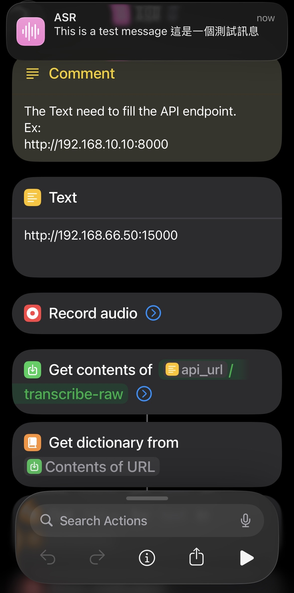

# whisper-wrap

FastAPI wrapper for [whisper.cpp](https://github.com/ggml-org/whisper.cpp) with universal audio format support.

> **Built on whisper.cpp** - This project leverages the powerful [whisper.cpp](https://github.com/ggml-org/whisper.cpp) implementation by [ggml-org](https://github.com/ggml-org) to provide fast, local speech-to-text transcription powered by OpenAI's Whisper models.

## 🚀 Quick Start

```bash
# Complete setup (first time)
make setup

# Start both services
make dev

# Test the API
curl -X POST "http://localhost:8000/transcribe" \
     -F "file=@your-audio-file.mp3"
```

## ✨ Features

- **Universal Format Support**: Accepts any audio/video format (mp3, wav, m4a, flac, ogg, aac, mp4, avi, mov, mkv)
- **iOS Shortcuts Integration**: Ready-to-use shortcut for voice transcription
- **Automatic Conversion**: Uses ffmpeg to convert files to WAV format for whisper
- **Production Ready**: Built with FastAPI, Docker support, health monitoring
- **Configurable Ports**: Flexible deployment with custom port configuration

## 🏗️ Architecture

```
┌─────────────────┐    ┌─────────────────┐    ┌─────────────────┐
│   Client App    │───▶│  whisper-wrap   │───▶│ whisper-server  │
│  (iOS/Web/CLI)  │    │   (FastAPI)     │    │  (whisper.cpp)  │
│                 │    │   Port 8000     │    │   Port 9000     │
└─────────────────┘    └─────────────────┘    └─────────────────┘
```

## 📱 iOS Shortcuts Integration

**Ready-to-Use Shortcut**: 📱 **[Download ASR Shortcut](https://www.icloud.com/shortcuts/698627e2c3934b3e996426b64a943742)**



This shortcut provides a complete voice transcription workflow:
- 🎙️ **Record Audio**: Tap to record voice memos
- 🌐 **Auto-Transcribe**: Sends audio to your whisper-wrap server
- 📝 **Show Results**: Displays transcribed text immediately
- 📋 **Copy to Clipboard**: Automatically copies text for easy pasting anywhere
- ⚙️ **Configurable**: Easy server URL setup in shortcut settings

**Setup**: Install shortcut → Configure server URL → Test with voice recording

## 🔧 API Endpoints

### POST /transcribe
Standard multipart file upload:
```bash
curl -X POST "http://localhost:8000/transcribe" \
     -F "file=@audio.mp3"
```

### POST /transcribe-raw
Raw binary upload (iOS Shortcuts compatible):
```bash
curl -X POST "http://localhost:8000/transcribe-raw" \
     -H "Content-Type: audio/mp3" \
     --data-binary "@audio.mp3"
```

**Response**:
```json
{
  "text": "transcribed text content",
  "language": "en", 
  "duration": 123.45,
  "confidence": 0.95
}
```

## ⚙️ Configuration

Create a `.env` file for custom configuration:
```env
# API server
API_PORT=8000
API_HOST=0.0.0.0

# Whisper server
WHISPER_SERVER_HOST=localhost
WHISPER_SERVER_PORT=9000

# File handling
MAX_FILE_SIZE_MB=100
LOG_LEVEL=INFO
```

## 🐳 Docker Deployment

```bash
# Quick start with Docker
make docker

# Or manually
docker build -t whisper-wrap:latest .
docker run -p 8000:8000 whisper-wrap:latest
```

## 🛠️ Development

```bash
make help               # Show all available targets
make setup              # Complete setup (first time)
make dev                # Start development environment
make test               # Run test suite
make lint               # Code quality checks
```

## 📚 Documentation

- **[Installation Guide](docs/INSTALLATION.md)** - System requirements, dependencies, setup
- **[API Documentation](docs/API.md)** - Complete API reference with examples
- **[Deployment Guide](docs/DEPLOYMENT.md)** - Docker, production, monitoring
- **[Development Guide](docs/DEVELOPMENT.md)** - Contributing, testing, make targets
- **[Troubleshooting](docs/TROUBLESHOOTING.md)** - Common issues and solutions

## 🎯 Common Use Cases

- **Voice Memos**: Use iOS Shortcuts for instant voice-to-text
- **Batch Processing**: Process multiple audio files via command line
- **API Integration**: Embed transcription in your applications
- **Multi-language Support**: 100+ languages with automatic detection

## 📊 Performance

- **Speed**: ~2-4x real-time transcription
- **Memory**: 2-4GB RAM during processing
- **Formats**: All major audio/video formats supported
- **Languages**: 100+ languages with tier-based quality

## 💡 Quick Examples

**Python Integration**:
```python
import httpx

with open("audio.mp3", "rb") as f:
    response = httpx.post(
        "http://localhost:8000/transcribe-raw",
        headers={"Content-Type": "audio/mp3"},
        content=f.read()
    )
    print(response.json()["text"])
```

**Batch Processing**:
```bash
for file in *.mp3; do
  curl -X POST "http://localhost:8000/transcribe" \
       -F "file=@$file" \
       -o "${file%.mp3}.json"
done
```

## 🔍 System Requirements

- **RAM**: 4GB minimum, 8GB+ recommended
- **Python**: 3.8+
- **Dependencies**: ffmpeg, libmagic, cmake
- **Platforms**: macOS, Linux, Windows (WSL2)

## 🆘 Need Help?

- **Quick Issues**: Check [Troubleshooting](docs/TROUBLESHOOTING.md)
- **Installation**: See [Installation Guide](docs/INSTALLATION.md)
- **API Questions**: Refer to [API Documentation](docs/API.md)
- **Deployment**: Follow [Deployment Guide](docs/DEPLOYMENT.md)

## 🙏 Acknowledgments

This project is built upon the excellent work of:
- **[whisper.cpp](https://github.com/ggml-org/whisper.cpp)** by [ggml-org](https://github.com/ggml-org) - High-performance C++ implementation of OpenAI's Whisper
- **[OpenAI Whisper](https://github.com/openai/whisper)** - The original speech recognition model and research
- **[GGML](https://github.com/ggerganov/ggml)** - Tensor library that powers whisper.cpp's efficient inference

Special thanks to the whisper.cpp community for creating a fast, local, and production-ready speech-to-text solution.

## 📄 License

This project is licensed under the MIT License - see the [LICENSE](LICENSE) file for details.

**Note**: This project uses whisper.cpp as a dependency, which is also MIT licensed. The underlying Whisper models are released under the MIT license by OpenAI.