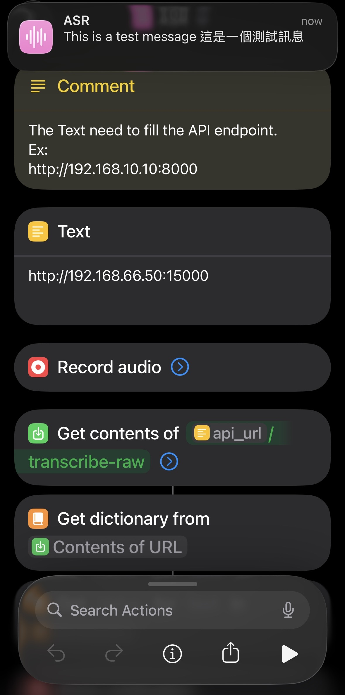

# whisper-wrap

Single-process FastAPI server for **in-process audio transcription, live captioning, and Gemini-backed Q&A**.

v2.1 ships two Whisper backends in the same codebase and picks one at startup based on the host OS:

- **macOS** — [`pywhispercpp`](https://github.com/absadiki/pywhispercpp) (whisper.cpp binding) with Core ML encoder on the Apple Neural Engine. Decision rationale: CTranslate2 has no Metal/Core ML path so it falls back to CPU; same Mac mini reaches 5-7× real-time via ANE.
- **Linux** — [`faster-whisper`](https://github.com/SYSTRAN/faster-whisper) (CTranslate2). Keeps the GPU/CUDA path open for the future PVE deployment.

Both backends conform to the same `WhisperBackend` Protocol; the `/transcribe`, `/ask`, and `WS /listen` endpoints don't know which one is loaded. Override the auto-selection with `BACKEND_FORMAT=ct2` or `BACKEND_FORMAT=ggml`.

> v2 was never released externally, so v2.1 carries no migration. The `registry/models.yaml` schema is new (variants list per model).

## 🚀 Quick Start

### Prerequisites (one-time on a fresh machine)

```bash
# macOS
brew install ffmpeg libmagic
curl -fsSL https://astral.sh/uv/install.sh | sh      # Python deps
curl -fsSL https://bun.sh/install | bash             # PWA bundler

# Linux
sudo apt-get install ffmpeg libmagic1 libmagic-dev   # (or yum / pacman)
curl -fsSL https://astral.sh/uv/install.sh | sh
curl -fsSL https://bun.sh/install | bash
```

### Run it

```bash
# Install deps + download the default model + build the PWA (5-15 min)
make setup

# Start the server (foreground; Ctrl-C to stop)
make dev

# Test transcription
curl -X POST http://localhost:8000/transcribe \
     -F "file=@your-audio-file.mp3"
```

Open `http://localhost:8000/app/` for the PWA, `http://localhost:8000/status` for health.

**Want autostart + crash-recovery?** See [docs/DEPLOYMENT.md](docs/DEPLOYMENT.md) — `make install-launchd` on macOS, systemd unit sketch for Linux.

## ✨ Features

- **Dual in-process backend** (v2.1): pywhispercpp + Core ML/ANE on macOS, faster-whisper + CTranslate2 on Linux. No subprocess, no second port. `WS /listen` partial latency drops from ~3-5 s to <1 s on Mac mini via Apple Neural Engine.
- **Unified `/transcribe`**: Content-Type dispatch handles multipart uploads, raw `audio/*` bodies, and `application/octet-stream` from iOS Shortcuts in one endpoint.
- **`/ask` with optional SSE streaming**: audio or text in, Gemini answer out. `?stream=true` returns `text/event-stream` with `transcript` → `token*` → `done` events.
- **`/listen` WebSocket**: live captioning — 16 kHz mono `pcm_s16le` frames in, timestamped `partial`/`final` events out. v2.1 adds a partial-consensus filter (simplified LocalAgreement-2) so `partial` text no longer thrashes between inferences. v2.2 swaps the RMS-energy VAD for [silero-vad](https://github.com/snakers4/silero-vad) (neural; with RMS fallback) so utterance endpointing is robust against environmental noise and quiet speech.
- **Rich `/status`**: loaded model details, runtime device, compute type, Gemini configuration, uptime — useful for distinguishing Mac mini vs GPU deployments at a glance.
- **Variants-aware model registry** (v2.1): `registry/models.yaml` ships `breeze-asr-25` with both a `ct2` and a `ggml` variant (`q6_k` quantisation + bundled `.mlmodelc` Core ML encoder), plus `large-v3-turbo` as the multilingual fallback. `make download-model MODEL=<name>` fetches every variant for that model.
- **iOS Shortcuts ready**: bundled shortcut for one-tap voice transcription.

## 🏗️ Architecture

```
┌──────────────────┐         ┌────────────────────────────────────┐
│   Client App     │───────▶ │  whisper-wrap (FastAPI, port 8000) │
│  (iOS/Web/CLI)   │         │  ├── /transcribe                   │
│                  │         │  ├── /ask  → Gemini API            │
│                  │         │  ├── /listen (WebSocket)           │
│                  │         │  ├── /status, /                    │
│                  │         │  └── in-process faster-whisper     │
└──────────────────┘         └────────────────────────────────────┘
```

## 📱 iOS Shortcuts Integration

**Ready-to-Use Shortcut**: 📱 **[Download ASR Shortcut](https://www.icloud.com/shortcuts/698627e2c3934b3e996426b64a943742)**



This shortcut provides a complete voice transcription workflow:
- 🎙️ **Record Audio**: Tap to record voice memos
- 🌐 **Auto-Transcribe**: Sends audio to your whisper-wrap server
- 📝 **Show Results**: Displays transcribed text immediately
- 📋 **Copy to Clipboard**: Automatically copies text for easy pasting anywhere
- ⚙️ **Configurable**: Easy server URL setup in shortcut settings

**Setup**: Install shortcut → Configure server URL → Test with voice recording

## 🔧 API Endpoints

### POST /transcribe
Multipart file upload, raw `audio/*` body, or `application/octet-stream` — the
handler branches on `Content-Type`:

```bash
# Multipart (web/CLI clients)
curl -X POST "http://localhost:8000/transcribe" \
     -F "file=@audio.mp3"

# Raw body (iOS Shortcuts)
curl -X POST "http://localhost:8000/transcribe" \
     -H "Content-Type: audio/mp3" \
     --data-binary "@audio.mp3"
```

**Response**:
```json
{
  "text": "transcribed text content",
  "language": "en", 
  "duration": 123.45,
  "confidence": 0.95
}
```

### OpenAI Whisper-compatible surface (v2.3)

For drop-in use with any OpenAI-Whisper-compatible client
(open-webui, LibreChat, the OpenAI SDK, etc.) whisper-wrap exposes:

| Method | Path                          | Description                                                              |
| ------ | ----------------------------- | ------------------------------------------------------------------------ |
| POST   | `/v1/audio/transcriptions`    | OpenAI-compatible audio transcription endpoint                           |
| POST   | `/v1/audio/translations`      | OpenAI-compatible audio translation endpoint (output: English)           |
| GET    | `/v1/models`                  | OpenAI-compatible model catalogue (lists the active whisper-wrap model)  |

`response_format` accepts `json` (default), `text`, `srt`, `verbose_json`,
and `vtt`. The `model` request field is advisory — whisper-wrap loads
exactly one model per process; any non-empty value is accepted, with a
WARNING log when it doesn't match an OpenAI alias or the active model.

```bash
# Drop-in OpenAI SDK example (Python)
from openai import OpenAI
client = OpenAI(base_url="http://localhost:8000/v1", api_key="any")
with open("audio.mp3", "rb") as f:
    print(client.audio.transcriptions.create(model="whisper-1", file=f).text)
```

See [`docs/INSTALLATION.md`](docs/INSTALLATION.md#openai-compatible-front-ends-open-webui)
for the open-webui Docker recipe.

### Built-in PWA: live captioning client (v2.4)

A Vite-built, installable Progressive Web App ships with whisper-wrap at
`/app/`. It captures the browser microphone, streams 16 kHz PCM to
`WS /listen`, renders partial-to-final captions in real time, persists the
last 20 sessions to `localStorage`, and lets you run pre-defined Action
templates (defined in `registry/actions.yaml`, surfaced via `GET /actions`)
against the transcript via `POST /ask`.

| Method | Path | Description |
| ------ | ---- | --- |
| GET    | `/app/`    | PWA live-captioning client (open in browser, install to home screen) |
| GET    | `/actions` | Action templates registry (consumed by the PWA's chip bar) |

```bash
make build-frontend     # one-time: produces app/static/app/
make dev                # serves whisper-wrap + the PWA on http://localhost:8000/app/
```

Reach it from a phone over your tailnet by running `make dev-https` once you
have a Tailscale cert — see [`docs/HTTPS-TAILSCALE.md`](docs/HTTPS-TAILSCALE.md).

## 🤖 Model Management

whisper-wrap includes a built-in model registry with 6 pre-configured models:

| Model | Size | Languages | Description |
|-------|------|-----------|-------------|
| `large-v3-turbo` | 1.6GB | Multilingual | Fast, general purpose |
| **`large-v3-turbo-q8`** | 874MB | Multilingual | 8-bit quantized (default) |
| `breeze-asr-25` | 3.1GB | zh-TW, en | Taiwanese Mandarin + English code-switching |
| `breeze-asr-25-q8` | 1.7GB | zh-TW, en | Breeze ASR 25 (8-bit quantized) |
| `large-v3` | 3.1GB | Multilingual | Highest accuracy, slower |
| `medium` | 1.5GB | Multilingual | Balanced speed/accuracy |
| `base` | 148MB | Multilingual | Lightweight, fast |

```bash
# List available models and their install status
make models

# Download a model
make download-model MODEL=breeze-asr-25

# Switch active model
make set-model MODEL=breeze-asr-25

# Delete a model
make delete-model MODEL=base
```

Or use the CLI wrapper:
```bash
./whisper-wrap models              # List models
./whisper-wrap download breeze-asr-25   # Download
./whisper-wrap use breeze-asr-25        # Switch model
```

## ⚙️ Configuration

Create a `.env` file for custom configuration (see `.env.example` for the full
list):

```env
# API server
API_PORT=8000
API_HOST=0.0.0.0

# Model
MODEL_NAME=breeze-asr-25         # Registry key (./models/breeze-asr-25)
# MODEL_DIR=/absolute/path       # Bypass registry lookup
COMPUTE_TYPE=default             # Required on Apple Silicon CPU
DEVICE=auto

# Gemini (for /ask)
GEMINI_API_KEY=
GEMINI_MODEL=gemini-3.1-flash-lite
# GEMINI_SYSTEM_PROMPT=          # Falls back to a Taiwan-friendly default

# File handling
MAX_FILE_SIZE_MB=100
LOG_LEVEL=INFO

# Transcription post-process filter
# FILTER_EMPTY_ENABLED=true
# FILTER_MIN_DURATION_MS=500
```

### Transcription post-processing filter

Whisper occasionally returns empty strings or pure punctuation (e.g. `。`, `。。。`)
for noise inputs. The post-processing filter is **enabled by default** and
suppresses those results across every transcription surface:

- `WS /listen` — no `final` JSON frame is emitted for the dropped utterance.
- `POST /transcribe` — the response body becomes `{"text": ""}`.
- `POST /ask` — returns HTTP `400 {"error": "no_speech_detected"}` and **does not
  invoke Gemini**, saving tokens on noise inputs. The streaming variant emits a
  single `event: error` frame and closes.
- `POST /v1/audio/transcriptions` and `POST /v1/audio/translations` — preserve
  the OpenAI response schema with `text: ""` (and `segments: []` for
  `verbose_json`); no custom fields are added.

Two environment variables tune the filter:

- `FILTER_EMPTY_ENABLED` (default `true`) — set to `false` to disable, e.g. when
  diagnosing why a real utterance appears to have been dropped.
- `FILTER_MIN_DURATION_MS` (default `500`) — speech shorter than this is dropped
  on `/listen`. Lower to `300` if single CJK characters get filtered.

Every drop is logged at `INFO` as a structured `transcription_filtered` record
(`extra` fields: `endpoint`, `reason`, `response_format`/`stream`,
`raw_text_len`) so operators can grep server logs to verify the filter is
behaving as expected.

## 🐳 Docker Deployment

```bash
# Quick start with Docker (uses default model: breeze-asr-25)
make docker

# Build with a specific model
docker build --build-arg MODEL_NAME=breeze-asr-25 -t whisper-wrap:latest .
docker run -p 8000:8000 whisper-wrap:latest
```

## 🛠️ Development

```bash
make help               # Show all available targets
make setup              # Complete setup (first time)
make dev                # Start development environment
make test               # Run test suite
make lint               # Code quality checks
```

## 📚 Documentation

- **[Installation Guide](docs/INSTALLATION.md)** - System requirements, dependencies, setup
- **[Deployment Guide](docs/DEPLOYMENT.md)** - End-to-end Mac mini recipe, launchd autostart, log management
- **[API Documentation](docs/API.md)** - Complete API reference with examples
- **[HTTPS via Tailscale](docs/HTTPS-TAILSCALE.md)** - Reach the PWA from your phone with mic permission
- **[Troubleshooting](docs/TROUBLESHOOTING.md)** - Common issues and solutions

## 🎯 Common Use Cases

- **Voice Memos**: Use iOS Shortcuts for instant voice-to-text
- **Taiwanese Mandarin**: Use Breeze ASR 25 for zh-TW + English code-switching
- **Batch Processing**: Process multiple audio files via command line
- **API Integration**: Embed transcription in your applications
- **Multi-language Support**: 100+ languages with automatic detection

## 📊 Performance

- **Speed**: ~2-4x real-time transcription
- **Memory**: 2-4GB RAM during processing
- **Formats**: All major audio/video formats supported
- **Languages**: 100+ languages with tier-based quality

## 💡 Quick Examples

**Python Integration**:
```python
import httpx

with open("audio.mp3", "rb") as f:
    response = httpx.post(
        "http://localhost:8000/transcribe",
        headers={"Content-Type": "audio/mp3"},
        content=f.read()
    )
    print(response.json()["text"])
```

**Batch Processing**:
```bash
for file in *.mp3; do
  curl -X POST "http://localhost:8000/transcribe" \
       -F "file=@$file" \
       -o "${file%.mp3}.json"
done
```

## 🔍 System Requirements

- **RAM**: 4GB minimum, 8GB+ recommended
- **Python**: 3.8+
- **Dependencies**: ffmpeg, libmagic, cmake
- **Platforms**: macOS, Linux, Windows (WSL2)

## 🆘 Need Help?

- **Quick Issues**: Check [Troubleshooting](docs/TROUBLESHOOTING.md)
- **Installation**: See [Installation Guide](docs/INSTALLATION.md)
- **API Questions**: Refer to [API Documentation](docs/API.md)
- **Deployment**: Follow [Deployment Guide](docs/DEPLOYMENT.md)

## 🙏 Acknowledgments

This project is built upon the excellent work of:
- **[faster-whisper](https://github.com/SYSTRAN/faster-whisper)** by SYSTRAN — CTranslate2-based Whisper runtime that powers v2's in-process backend
- **[CTranslate2](https://github.com/OpenNMT/CTranslate2)** by OpenNMT — fast inference engine for Transformer models
- **[OpenAI Whisper](https://github.com/openai/whisper)** — the original speech recognition model and research
- **[Breeze ASR 25](https://huggingface.co/MediaTek-Research/Breeze-ASR-25)** by [MediaTek Research](https://github.com/MediaTek-Research) — Taiwanese Mandarin + English code-switching ASR model
- **[Google Gemini](https://ai.google.dev/)** — LLM backend for `/ask`

v1 was built around `whisper.cpp` (kept in `CHANGELOG.md` as historical context); v2 transitions to faster-whisper / CTranslate2 for a single-process server.

## 📄 License

This project is licensed under the MIT License — see the [LICENSE](LICENSE) file for details.