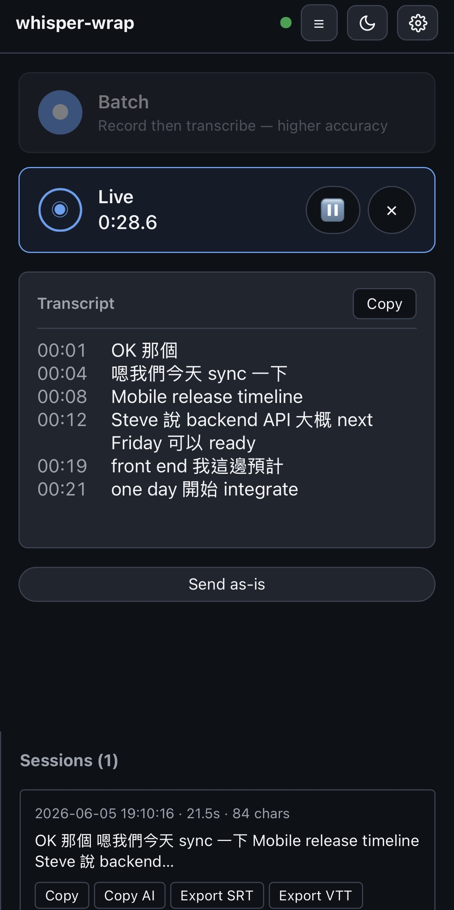
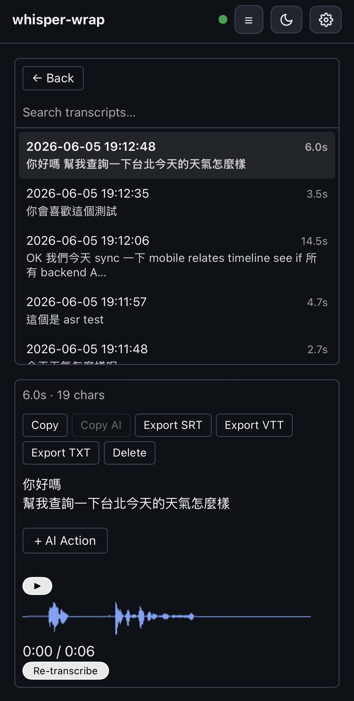
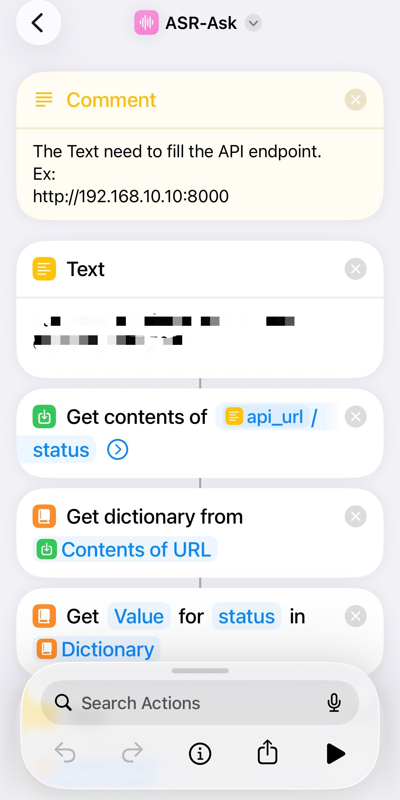

# whisper-wrap

[English](README.md) | **繁體中文**


單一 process 的 FastAPI 伺服器，提供「**in-process 音訊轉寫、即時字幕，以及由 Gemini 支援的 Q&A**」。

v2.1 在同一個 codebase 中內建兩種 Whisper backend，並依據主機 OS 在啟動時自動挑選其一：

- **macOS** — [`pywhispercpp`](https://github.com/absadiki/pywhispercpp)（whisper.cpp 的 binding），並透過 Core ML encoder 在 Apple Neural Engine 上執行。在 macOS 上 CTranslate2 沒有 Metal/Core ML 路徑會 fallback 到 CPU；pywhispercpp + Core ML 路徑透過 ANE 在 Apple Silicon 上可達 5-7× real-time。
- **Linux** — [`faster-whisper`](https://github.com/SYSTRAN/faster-whisper)（CTranslate2）。為未來的 GPU 部署保留 CPU/CUDA 路徑。

兩種 backend 都實作同一個 `WhisperBackend` Protocol；`/transcribe`、`/ask`、以及 `WS /listen` 這些 endpoint 並不會知道目前載入的是哪一個。可用 `BACKEND_FORMAT=ct2` 或 `BACKEND_FORMAT=ggml` 覆寫自動選擇。

> **測試覆蓋範圍**：macOS（Apple Silicon）走 ggml + Core ML 是主要開發環境，會持續驗證。Linux CUDA 路徑與 Docker image **目前都尚未測試過** — code 存在但沒有 end-to-end 驗證過。如果你有實際跑過，歡迎開 issue 回報哪些 work、哪些 broken。

## 📸 截圖

| 即時字幕 | 歷史紀錄 + AI Actions | Apple Shortcuts |
| - | - | - |
|  |  |  |
| 透過 `WS /listen` 即時 partial → final 字幕（PWA、可安裝到主畫面）。 | 瀏覽過去 session、搜尋、重播音檔、重跑 AI action、匯出 SRT/VTT/TXT。 | iOS/macOS Shortcut：錄音、丟給 `/ask`、把答案唸出來。 |

## 🚀 Quick Start

### 前置需求（新機器上一次性安裝）

```bash
# macOS
brew install ffmpeg libmagic
curl -fsSL https://astral.sh/uv/install.sh | sh      # Python deps
curl -fsSL https://bun.sh/install | bash             # PWA bundler

# Linux
sudo apt-get install ffmpeg libmagic1 libmagic-dev   # (or yum / pacman)
curl -fsSL https://astral.sh/uv/install.sh | sh
curl -fsSL https://bun.sh/install | bash
```

### 開始執行

```bash
# 安裝相依套件 + 下載預設模型 + 建置 PWA（5-15 分鐘）
make setup

# 啟動伺服器（前景執行；按 Ctrl-C 結束）
make dev

# 測試轉寫
curl -X POST http://localhost:8000/transcribe \
     -F "file=@your-audio-file.mp3"
```

開啟 `http://localhost:8000/app/` 進入 PWA，`http://localhost:8000/status` 查看健康狀態。

**想要開機自動啟動 + 崩潰自動恢復？** 請參閱 [docs/DEPLOYMENT.zh-TW.md](docs/DEPLOYMENT.zh-TW.md) — macOS 上執行 `make install-launchd`，Linux 則有 systemd unit 範例。

## ✨ 功能特色

- **雙 in-process backend**（v2.1）：macOS 上使用 pywhispercpp + Core ML/ANE，Linux 上使用 faster-whisper + CTranslate2。沒有 subprocess、也不需要第二個 port。在 Mac mini 上透過 Apple Neural Engine，`WS /listen` 的 partial latency 從 ~3-5 秒降至 <1 秒。
- **統一的 `/transcribe`**：以 Content-Type 分派，在單一 endpoint 內處理 multipart 上傳、原始 `audio/*` body，以及來自 iOS Shortcuts 的 `application/octet-stream`。
- **`/ask` 支援可選的 SSE 串流**：輸入音訊或文字，輸出 Gemini 的回覆。`?stream=true` 會回傳 `text/event-stream`，事件依序為 `transcript` → `token*` → `done`。
- **`/listen` WebSocket**：即時字幕 — 輸入 16 kHz mono `pcm_s16le` 音框，輸出帶 timestamp 的 `partial`/`final` 事件。v2.1 新增 partial-consensus filter（簡化版 LocalAgreement-2），讓 `partial` 文字不再於每次推論間反覆抖動。v2.2 將原本的 RMS-energy VAD 換成 [silero-vad](https://github.com/snakers4/silero-vad)（neural，並保留 RMS fallback），讓 utterance 端點偵測在環境噪音與小聲說話下都更穩定。
- **豐富的 `/status`**：載入的模型細節、runtime device、compute type、Gemini 設定、uptime — 對於一眼分辨 Mac mini 與 GPU 部署非常實用。
- **支援 variants 的模型 registry**（v2.1）：`registry/models.yaml` 提供 `breeze-asr-25`，同時包含 `ct2` 與 `ggml` 兩種 variant（`q6_k` quantisation + 內附的 `.mlmodelc` Core ML encoder），另有 `large-v3-turbo` 作為多語 fallback。`make download-model MODEL=<name>` 只會抓取本機平台會載入的 variant；加 `ALL=1` 才會抓全部。
- **Meeting Mode**（v2.5）：長音檔上傳 → 透過 WhisperX + pyannote 產生帶 speaker 標記、word-level timestamp 的逐字稿。可選的 `?fast=true` 會改用 `/transcribe` 的 ggml+ANE backend 做 ASR（跳過 WhisperX 的 CT2），在 macOS 上把 wall-clock 砍掉 **約 3×**，同時保留 diarization。結果會持久化到以 SQLite 為底的 `/v1/meetings` API，並可選擇連同原始音檔一起儲存，讓 PWA 的歷史側欄在重啟後依然存在、且能跨裝置存取。
- **PWA Batch 檔案上傳**：在 Batch 卡片上拖放或挑選現有音檔，不必重新錄音 — 走同一套 `/transcribe` pipeline，不需要第二個 endpoint。
- **iOS Shortcuts 開箱即用**：附帶的捷徑可一鍵語音轉寫。

## 🏗️ 架構

```
┌──────────────────┐         ┌────────────────────────────────────┐
│   Client App     │───────▶ │  whisper-wrap (FastAPI, port 8000) │
│  (iOS/Web/CLI)   │         │  ├── /transcribe                   │
│                  │         │  ├── /ask  → Gemini API            │
│                  │         │  ├── /listen (WebSocket)           │
│                  │         │  ├── /status, /                    │
│                  │         │  └── in-process faster-whisper     │
└──────────────────┘         └────────────────────────────────────┘
```

## 📱 iOS Shortcuts 整合

兩個現成可用的捷徑。匯入時會問你 server URL（預設 `localhost`）— 你的真實 endpoint 不會被打包進 share 出去的檔案。

| 捷徑 | 功能 | 安裝 |
| - | - | - |
| **ASR** | 錄音 → `/transcribe` → 文字複製到剪貼簿。 | 📱 [加入捷徑](https://www.icloud.com/shortcuts/cc6e3b42e9c743ec9d15db4c30d0c205) |
| **ASR-Ask** | 錄音 → `/ask` → 把 Gemini 答案唸出來。 | 📱 [加入捷徑](https://www.icloud.com/shortcuts/02d03d53364e49bab0542a2a6daa3cb6) |


**設定**：點連結 → 「加入捷徑」 → 第一次執行時填你的 endpoint（例如 `http://192.168.1.10:8000`，或 Tailscale 的 `https://...ts.net:PORT`）。

## 🔧 API Endpoints

### POST /transcribe
支援 multipart 檔案上傳、原始 `audio/*` body、或 `application/octet-stream` — handler 會依 `Content-Type` 分派：

```bash
# Multipart（web/CLI 客戶端）
curl -X POST "http://localhost:8000/transcribe" \
     -F "file=@audio.mp3"

# 原始 body（iOS Shortcuts）
curl -X POST "http://localhost:8000/transcribe" \
     -H "Content-Type: audio/mp3" \
     --data-binary "@audio.mp3"
```

**回應**：
```json
{
  "text": "transcribed text content",
  "language": "en", 
  "duration": 123.45,
  "confidence": 0.95
}
```

### OpenAI Whisper 相容介面（v2.3）

為了讓任何 OpenAI-Whisper 相容的 client（open-webui、LibreChat、OpenAI SDK 等）能直接無痛使用，whisper-wrap 提供：

| Method | Path                          | 說明                                                                      |
| ------ | ----------------------------- | ------------------------------------------------------------------------ |
| POST   | `/v1/audio/transcriptions`    | OpenAI 相容的音訊轉寫 endpoint                                              |
| POST   | `/v1/audio/translations`      | OpenAI 相容的音訊翻譯 endpoint（輸出：英文）                                  |
| GET    | `/v1/models`                  | OpenAI 相容的模型目錄（列出目前 whisper-wrap 載入的模型）                     |

`response_format` 接受 `json`（預設）、`text`、`srt`、`verbose_json`、`vtt`。`model` 欄位僅供參考 — whisper-wrap 每個 process 只載入一個模型；任何非空值都會被接受，若不是 OpenAI 別名或目前模型名稱，會輸出一筆 WARNING log。

```bash
# 直接拿 OpenAI SDK 來用的範例（Python）
from openai import OpenAI
client = OpenAI(base_url="http://localhost:8000/v1", api_key="any")
with open("audio.mp3", "rb") as f:
    print(client.audio.transcriptions.create(model="whisper-1", file=f).text)
```

open-webui 的 Docker 設定請參閱 [`docs/INSTALLATION.zh-TW.md`](docs/INSTALLATION.zh-TW.md#openai-compatible-front-ends-open-webui)。

### 內建 PWA：即時字幕 client（v2.4）

whisper-wrap 內附一個用 Vite 建置、可安裝的 Progressive Web App，掛載在 `/app/`。它會擷取瀏覽器麥克風、把 16 kHz PCM 串流送到 `WS /listen`、即時把 partial 轉成 final 字幕渲染出來、把最近 20 個 session 保存在 `localStorage`，並且讓你能透過 `POST /ask` 對 transcript 執行預先定義好的 Action 範本（定義於 `registry/actions.yaml`，透過 `GET /actions` 對外）。

Batch 擷取卡片同時也接受**檔案上傳** — 點 📁 或把音檔拖進去，就能轉寫既有的錄音，而不必重新錄一段。走同一套 `/transcribe` pipeline，不需要第二個 endpoint。

另有一個獨立的 **Meeting Mode** 頁面，位於 `/app/#/meeting`（長音檔 diarization 工作流程、chat/detail 檢視切換與 AI Enhance，詳見下方 [Meeting Mode](#-meeting-mode) 章節）。

| Method | Path | 說明 |
| ------ | ---- | --- |
| GET    | `/app/`          | PWA 即時字幕 client（Live、Batch、Meeting 三種模式） |
| GET    | `/app/#/meeting` | Meeting Mode 頁面（diarization、AI Enhance、歷史側欄） |
| GET    | `/actions`       | Action 範本 registry（由 chip bar 使用） |

```bash
make build-frontend     # 一次性：產生 app/static/app/
make dev                # 同時提供 whisper-wrap 與 PWA，網址 http://localhost:8000/app/
```

只要你拿到 Tailscale 的憑證，執行 `make dev-https` 後就可以從手機透過 tailnet 連進來 — 請參閱 [`docs/HTTPS-TAILSCALE.zh-TW.md`](docs/HTTPS-TAILSCALE.zh-TW.md)。

## 🤖 模型管理

whisper-wrap 在 registry 中內附兩個模型。每個模型有一個或多個「**變體**」（對應特定 backend 的封裝）。`make download-model MODEL=<name>` 會抓取本機平台對應的變體；加 `ALL=1` 才會抓取所有宣告的變體。

| 模型 | 大小 | 語言 | 說明 |
|-------|------|-----------|-------------|
| **`breeze-asr-25`** ✅ 預設 | 1.5-2.0 GB | zh-TW, en | MediaTek Breeze ASR 25 — 台灣中文 + 英文混合語碼 |
| `large-v3-turbo` | 1.6 GB | 多語 | OpenAI Whisper large-v3-turbo — 多語 fallback |

### 來源（Hugging Face）

| 模型 | 變體 | Backend | 量化 / Compute | 大小 | Hugging Face repo |
|-------|---------|---------|----------------|------|-------------------|
| `breeze-asr-25` | `ct2` | faster-whisper（Linux 預設） | `int8_float16` | ~1.5 GB | [shdennlin/breeze-asr-25-ct2](https://huggingface.co/shdennlin/breeze-asr-25-ct2) |
| `breeze-asr-25` | `ggml` | pywhispercpp + Core ML（macOS 預設） | `q6_k` | ~1.5 GB | [shdennlin/breeze-asr-25-ggml](https://huggingface.co/shdennlin/breeze-asr-25-ggml) |
| `large-v3-turbo` | `ct2` | faster-whisper | `int8_float16` | ~1.6 GB | [Systran/faster-whisper-large-v3-turbo](https://huggingface.co/Systran/faster-whisper-large-v3-turbo) |

**量化 / Compute 說明**：
- `q6_k` — whisper.cpp 6-bit K-quants。檔案約為原始 FP16 的 37%，品質接近無損。ggml 變體同時包含一個 Core ML `.mlmodelc` encoder，用來在 ANE 上加速。
- `int8_float16` — CTranslate2 mixed precision：int8 權重 + float16 啟動值。在 CUDA 上是 CT2 的標準路徑。Apple Silicon CPU 跑 ct2 時會自動 fallback 到 `default`——`COMPUTE_TYPE` 環境變數在那個情境下沒有效果。

**上游來源**：`shdennlin/breeze-asr-25-*` 是基於 MediaTek 原版 Breeze ASR 25 進行量化 + 格式轉換後的版本。`Systran/faster-whisper-large-v3-turbo` 則是 OpenAI [`openai/whisper-large-v3-turbo`](https://huggingface.co/openai/whisper-large-v3-turbo) 的 CT2 重新封裝版。

若想加入其他模型（例如 `large-v3`、`medium`、`base`），在 `registry/models.yaml` 內新增一個項目，指向任意 CT2 格式的 Hugging Face repo 即可。請參考該檔案最上方的 schema 註解。建議的 CT2 repo：[`Systran/faster-whisper-large-v3`](https://huggingface.co/Systran/faster-whisper-large-v3)、[`Systran/faster-whisper-medium`](https://huggingface.co/Systran/faster-whisper-medium)、[`Systran/faster-whisper-base`](https://huggingface.co/Systran/faster-whisper-base)。

```bash
# 列出 registry 內所有項目 + 顯示目前平台啟用的變體
make models

# 只下載本機平台會用到的變體（macOS → ggml、Linux → ct2），約 1.5 GB
make download-model MODEL=breeze-asr-25

# 下載該模型的所有變體（breeze-asr-25 約 3 GB）
# 用在同台機器要 benchmark ct2 vs ggml 的場景
ALL=1 make download-model MODEL=breeze-asr-25

# 切換目前使用的模型（若該模型的 active variant 尚未下載會拒絕）
make set-model MODEL=breeze-asr-25

# 從磁碟刪除某模型的所有變體目錄
make delete-model MODEL=large-v3-turbo
```

## 🎙️ Meeting Mode

`POST /transcribe/meeting` 是一個需自行啟用（opt-in）的長音檔 endpoint，結合了
Whisper ASR、用來取得 word-level timestamp 的 forced phoneme alignment，以及
[pyannote.audio](https://github.com/pyannote/pyannote-audio) 的 speaker
diarization（透過 [WhisperX](https://github.com/m-bain/whisperX)）。它會在第一次
請求時 lazy load，且完全不影響其他 endpoint（`/transcribe`、`/listen`、`/ask`、
`/v1/*`）。

### 安裝

三個前置條件 — 任一缺少時，endpoint 會回傳 HTTP 503 並附上清楚的 `reason`：

1. **安裝可選的 extras**（約 1.5 GB：whisperx + pyannote.audio + torch）：

   ```bash
   uv sync --extra meeting
   ```

2. **在 Hugging Face 上同意 pyannote 的使用者授權**，三個 gated repo 都要 —
   否則 diarization 會 403：

   - https://huggingface.co/pyannote/speaker-diarization-3.1
   - https://huggingface.co/pyannote/segmentation-3.0
   - https://huggingface.co/pyannote/speaker-diarization-community-1

   第三個是 3.1 pipeline 在建構時會抓下來的 transitive PLDA backend — 很容易漏掉，
   直到第一個 job 失敗才會發現。

3. **在 `.env` 設定 `HF_TOKEN`**，token 需具備上述已同意模型的讀取權限。沒有它時，
   `/transcribe/meeting` 會回傳
   `503 {"error": "meeting_unavailable", "reason": "HF_TOKEN is not configured"}`，
   且 `/status.meeting.hf_token_configured` 為 `false`。

若想為了 air-gapped 環境或避免首次請求的延遲，預先下載 pyannote 權重「以及」CT2 ASR
variant：

```bash
# Linux（ct2 本來就是平台預設）：
DIARIZE=1 make download-model MODEL=breeze-asr-25

# macOS — 額外加上 ALL=1，讓 WhisperX 必需的 CT2 variant 連同
# /transcribe 用來做 ANE 加速的 ggml variant 一起下載：
ALL=1 DIARIZE=1 make download-model MODEL=breeze-asr-25
```

如果預抓過程出現 `GatedRepoError`，到錯誤訊息指名的那個 URL 點「Agree」，再重跑指令即可
— 這個指令是 idempotent 的。

### 使用方式

```bash
# 上傳一場會議 → 回傳一個 job handle。
# ?fast=true     改用 /transcribe 的平台預設 backend 做 ASR
#                （macOS 上是 ggml+ANE、Linux 上是 ct2+CUDA），接著把
#                segments 交給 WhisperX align + pyannote diarize 在 MPS 上跑。
#                在 Apple Silicon 上約快 3×。除非你需要 WhisperX CT2 路徑的
#                word-level alignment 精度，否則建議使用。
# ?filename=...  會顯示為 PWA 歷史側欄裡的會議標題。
curl -s -X POST "http://localhost:8000/transcribe/meeting?fast=true&filename=Q3-review.m4a" \
  -H "Content-Type: audio/wav" \
  --data-binary @meeting.wav
# → {"job_id":"01JFA…","status_url":"/transcribe/meeting/01JFA…"}

# 輪詢直到 status == "done"
curl -s http://localhost:8000/transcribe/meeting/01JFA…
# → {"status":"done","progress":1.0,"stage":"complete",
#    "result":{"language":"zh","duration_seconds":1823.4,
#              "speakers":["SPEAKER_00","SPEAKER_01"],
#              "segments":[{"speaker":"SPEAKER_00",
#                           "start":0.52,"end":4.18,
#                           "text":"今天會議的主題是…","words":[…]},…]}}

# 取消執行中的 job（best-effort，於 stage 邊界生效）。
curl -s -X DELETE http://localhost:8000/transcribe/meeting/01JFA…
```

PWA 的 Meeting Mode 頁面（`/app/#/meeting`）把同一套工作流程包成：
**chat / detail 檢視模式切換**、**hover ✏️ 重新命名 speaker**、
**點擊跳轉（click-to-seek）音檔播放**、**AI Enhance**（重用主頁面的
`registry/actions.yaml` chips — `Meeting notes` 會產生結構化摘要）、
speaker-aware 的 **SRT / VTT / TXT (chat) / TXT (script) / JSON** 匯出、
可編輯的**會議筆記標題**，以及一個持久化的歷史側欄。

### 持久化歷史與跨裝置重播

會議分析結果（若有上傳，連同原始音檔）會持久化到既有的 SQLite 歷史 DB，因此 PWA
側欄能在記憶體 job-store TTL（預設 1 小時）過期、伺服器重啟、以及從同一台伺服器的
另一裝置存取時都依然存在。

| Method | Path | 說明 |
| - | - | - |
| GET | `/v1/meetings` | 分頁列表（`limit`、`before_ms`）。 |
| GET | `/v1/meetings/{id}` | 單筆分析，含完整 result + speaker_names。 |
| POST | `/v1/meetings` | 建立（由 worker 自動持久化 + PWA 舊版 localStorage 遷移使用）。 |
| PATCH | `/v1/meetings/{id}` | 更新 `speaker_names` 與／或 `filename`。 |
| DELETE | `/v1/meetings/{id}` | 移除該筆紀錄「並」一併刪除音檔 sidecar。 |
| POST | `/v1/meetings/{id}/audio` | 以 sidecar 形式上傳原始音檔（multipart `file`）。 |
| GET | `/v1/meetings/{id}/audio` | 把音檔串流回來（`X-Content-Type-Options: nosniff`；MIME allowlist）。 |

### 效能

會議分析會跑三個階段 — ASR + wav2vec2 align + pyannote diarize。CTranslate2 沒有
Core ML/ANE backend，所以 slow-path 的 ASR 在 macOS 上只能留在 CPU；torch-native 的
align + diarize 階段「可以」吃 MPS，在 Apple Silicon 上能把這兩個階段的耗時砍掉 4-8×。

有兩條 ASR 路徑 — 在請求時透過 `?fast=true` 選擇：

| 路徑 | ASR backend | macOS Apple Silicon | 失去什麼 |
| - | - | - | - |
| **Fast（`?fast=true`）** | ggml + Core ML + ANE（同 `/transcribe`） | 1 小時會議 **約 3-5 分鐘** | 沒有 — diarize + align 照常執行 |
| Slow（`?fast=false`，預設） | WhisperX CT2 在 CPU 上 batched | 1 小時會議約 10-20 分鐘 | — |
| Linux + NVIDIA GPU | WhisperX CT2 在 CUDA 上 | 1 小時會議約 1-3 分鐘 | — |

在 macOS 上，Fast mode 是 PWA 的預設（可切換）。它在 Linux 上也能用 — 那邊會走
`/transcribe` 本來就在用的路徑（有 CUDA 就 ct2+CUDA，否則 ct2+CPU，等同 slow path）。

在 slow-path 的 macOS wall-clock 裡，ASR 佔大宗（約總時間的 70%）；fast mode 把這 70%
壓縮成 `/transcribe` 處理同一段音檔所需的時間（M 系列透過 ANE 約 10× real-time），只留下
約 2-5 分鐘的 align+diarize 尾段。

兩個可調參數（都在 `.env`，都有合理預設 — 只在 debug 效能時才需要動）：

```env
MEETING_BATCH_SIZE=32        # WhisperX ASR batch_size；16-64（僅 slow path）
MEETING_TORCH_DEVICE=auto    # auto | mps | cuda | cpu（align + diarize）
```

`MEETING_TORCH_DEVICE=auto` 會在 macOS 選 MPS、Linux 選 CUDA、其他情況選 CPU。強制指定
一個不可用的 device 時會寫一筆 WARN 並 fallback 到 CPU — 就算環境變數設錯，endpoint 仍可用。

伺服器啟動後的第一個請求，會額外花約 20-40 秒把 WhisperX 與 pyannote 模型載入記憶體；
後續的 job 會重用已在記憶體中的 pipeline。

### 準確度說明

- Diarization 品質在**語音重疊（overlapping speech）時會下降** — 大量交談重疊的段落可能
  被收斂成單一 speaker，或把同一個 speaker 拆成多個標籤。
- Pyannote 大約需要**每位 speaker 約 20 秒的語音**才能產生穩定的分離；很短的發話（單句）
  常會被併入鄰近的 speaker。
- 當事先就知道與會人數時，可在請求帶上 `num_speakers` 作為品質槓桿 — 它會約束 clustering
  階段，對 2-4 人的會議通常能明顯改善分離效果。

## ⚙️ 設定

建立 `.env` 檔案以做自訂設定（完整清單請見 `.env.example`）：

```env
# API server
API_PORT=8000
API_HOST=0.0.0.0

# Model
MODEL_NAME=breeze-asr-25         # Registry key (./models/breeze-asr-25)
# MODEL_DIR=/absolute/path       # Bypass registry lookup
COMPUTE_TYPE=default             # Required on Apple Silicon CPU
DEVICE=auto

# Gemini (for /ask)
GEMINI_API_KEY=
GEMINI_MODEL=gemini-3.1-flash-lite
# GEMINI_SYSTEM_PROMPT=          # Falls back to a Taiwan-friendly default

# File handling
MAX_FILE_SIZE_MB=100
LOG_LEVEL=INFO

# Transcription post-process filter
# FILTER_EMPTY_ENABLED=true
# FILTER_MIN_DURATION_MS=500
```

### 轉寫後處理 filter

Whisper 偶爾會對噪音輸入回傳空字串或純標點（例如 `。`、`。。。`）。這個後處理 filter「**預設為啟用**」，會在所有轉寫介面上抑制這類結果：

- `WS /listen` — 被丟棄的 utterance 不會送出 `final` JSON frame。
- `POST /transcribe` — 回應 body 變成 `{"text": ""}`。
- `POST /ask` — 回傳 HTTP `400 {"error": "no_speech_detected"}`，且「**不會呼叫 Gemini**」，避免在噪音輸入上浪費 token。串流版本會送出一個 `event: error` frame 然後關閉。
- `POST /v1/audio/transcriptions` 與 `POST /v1/audio/translations` — 保持 OpenAI 的回應 schema：`text: ""`（在 `verbose_json` 模式下另加 `segments: []`）；不會新增自訂欄位。

可用兩個環境變數調整 filter 行為：

- `FILTER_EMPTY_ENABLED`（預設 `true`）— 設為 `false` 可停用，例如在診斷為什麼某個實際的 utterance 被丟掉時。
- `FILTER_MIN_DURATION_MS`（預設 `500`）— `/listen` 上短於此長度的語音會被丟棄。若單一 CJK 字元被過濾掉，可調降到 `300`。

每次丟棄都會以 `INFO` 等級寫一筆結構化的 `transcription_filtered` 記錄（`extra` 欄位包含：`endpoint`、`reason`、`response_format`/`stream`、`raw_text_len`），方便維運人員 grep 伺服器 log 來確認 filter 是否如預期運作。

## 🐳 Docker 部署

> ⚠ **尚未測試**。Dockerfile 跟 `make docker` target 在 repo 裡是有的，但沒有
> 真的 end-to-end 跑過。ARM Mac 在 Docker 內也吃不到 Metal/Neural Engine
> （CT2 會 fallback 到 CPU、ggml 在容器內不會動)。如果你跑成功了，歡迎開 issue。

```bash
# 用 Docker 快速啟動（使用預設模型：breeze-asr-25）
make docker

# 用指定模型 build
docker build --build-arg MODEL_NAME=breeze-asr-25 -t whisper-wrap:latest .
docker run -p 8000:8000 whisper-wrap:latest
```

## 🛠️ 開發

```bash
make help               # 列出所有可用的 target
make setup              # 完整設定（第一次使用）
make dev                # 啟動開發環境
make test               # 執行測試套件
make lint               # 程式碼品質檢查
```

## 📚 文件

- **[安裝指引](docs/INSTALLATION.zh-TW.md)** - 系統需求、相依套件、設定流程
- **[部署指引](docs/DEPLOYMENT.zh-TW.md)** - Mac mini 端到端方案、launchd 開機自動啟動、log 管理
- **[API 文件](docs/API.zh-TW.md)** - 完整 API 參考與範例
- **[透過 Tailscale 使用 HTTPS](docs/HTTPS-TAILSCALE.zh-TW.md)** - 讓手機在具備麥克風權限的情況下連到 PWA
- **[疑難排解](docs/TROUBLESHOOTING.zh-TW.md)** - 常見問題與解法

## 🎯 常見使用情境

- **語音備忘**：用 iOS Shortcuts 立即語音轉文字
- **台灣中文**：用 Breeze ASR 25 處理 zh-TW + 英文混合語碼
- **批次處理**：用命令列處理多個音訊檔
- **API 整合**：把轉寫功能嵌入你的應用程式
- **多語支援**：100+ 種語言、自動偵測

## 📊 效能

- **速度**：~2-4x real-time 轉寫
- **記憶體**：處理過程中 2-4GB RAM
- **格式**：支援所有主流音訊／影片格式
- **語言**：100+ 種語言，分層品質

## 💡 快速範例

**Python 整合**：
```python
import httpx

with open("audio.mp3", "rb") as f:
    response = httpx.post(
        "http://localhost:8000/transcribe",
        headers={"Content-Type": "audio/mp3"},
        content=f.read()
    )
    print(response.json()["text"])
```

**批次處理**：
```bash
for file in *.mp3; do
  curl -X POST "http://localhost:8000/transcribe" \
       -F "file=@$file" \
       -o "${file%.mp3}.json"
done
```

## 🔍 系統需求

- **RAM**：最低 4GB，建議 8GB 以上
- **Python**：3.8+
- **相依套件**：ffmpeg、libmagic、cmake
- **平台**：macOS、Linux、Windows（WSL2）

## 🆘 需要協助？

- **快速排查**：請看 [疑難排解](docs/TROUBLESHOOTING.zh-TW.md)
- **安裝相關**：請看 [安裝指引](docs/INSTALLATION.zh-TW.md)
- **API 問題**：請參閱 [API 文件](docs/API.zh-TW.md)
- **部署相關**：請依循 [部署指引](docs/DEPLOYMENT.zh-TW.md)

## 🙏 致謝

本專案建立在以下優秀作品之上：
- **[faster-whisper](https://github.com/SYSTRAN/faster-whisper)** by SYSTRAN — 基於 CTranslate2 的 Whisper runtime，是 v2 in-process backend 的核心
- **[CTranslate2](https://github.com/OpenNMT/CTranslate2)** by OpenNMT — Transformer 模型的高效能推論引擎
- **[OpenAI Whisper](https://github.com/openai/whisper)** — 原始的語音辨識模型與研究
- **[Breeze ASR 25](https://huggingface.co/MediaTek-Research/Breeze-ASR-25)** by [MediaTek Research](https://github.com/MediaTek-Research) — 台灣中文 + 英文混合語碼 ASR 模型
- **[Google Gemini](https://ai.google.dev/)** — `/ask` 所使用的 LLM backend

v1 是以 `whisper.cpp` 為核心建構（作為歷史脈絡保留在 `CHANGELOG.md` 中）；v2 改用 faster-whisper / CTranslate2，提供單一 process 的伺服器。

## 📄 授權

本專案以 MIT License 授權 — 詳情請見 [LICENSE](LICENSE) 檔案。
